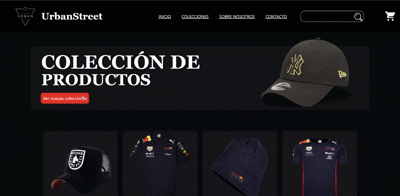

# 🧢 Catálogo de Gorras

Un **catálogo web moderno** desarrollado con **React**, **Tailwind CSS** y **React Router**, que permite a los clientes explorar gorras y realizar pedidos directamente por **WhatsApp**. Incluye autenticación para administrador y cliente, así como carrito de compras.

---

## 📌 Características principales

✅ **Catálogo dinámico** con imágenes, precios y descripciones.  
✅ **Inicio de sesión para administrador** para agregar, editar y eliminar productos.  
✅ **Inicio de sesión para clientes** (opcional, para pedidos personalizados).  
✅ **Carrito de compras** para agrupar productos seleccionados.  
✅ **Pedido por WhatsApp** con mensaje estructurado.  
✅ **Diseño responsive** gracias a Tailwind CSS.  
✅ **Rutas dinámicas** con React Router DOM.

## Vista previa


---

## 🛠️ Tecnologías utilizadas

- [React](https://react.dev/)
- [Vite](https://vitejs.dev/)
- [Tailwind CSS](https://tailwindcss.com/)
- [React Router DOM](https://reactrouter.com/)
- [Node.js](https://nodejs.org/)

---


---

## ⚙️ Instalación y ejecución en local

1. **Clonar el repositorio**
   ```bash
   git clone https://github.com/UrielGGarcia/urban-street.git
   cd urban-street

2. **Instalar dependencias**
   ```bash
   npm install

3. **Levantar el servidor de desarollo**
   ```
   npm run dev

